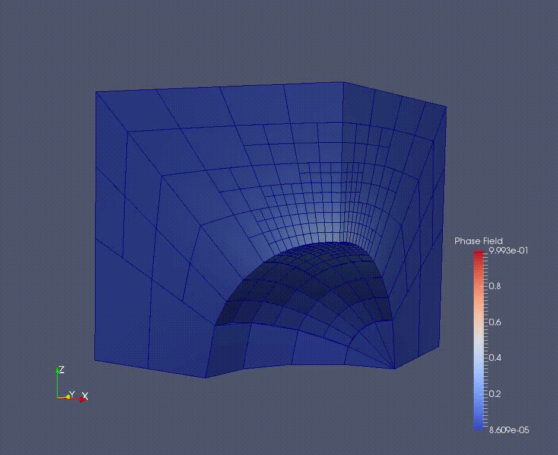

## Fracture modeling using Physics Informed Neural network

 [source](https://github.com/lululxvi/deepxde)

DeepXDE is a deep learning library for solving differential equations on top of [TensorFlow](https://www.tensorflow.org/).

Use DeepXDE if you need a deep learning library that

- solves partial differential equations (PDEs),
- solves integro-differential equations (IDEs),
- solves fractional partial differential equations (fPDEs),
- solves inverse problems for differential equations,
- approximates functions from a dataset with/without constraints,
- approximates functions from multi-fidelity data.

DeepXDE is extensible to solve other problems in scientific computing.

#

## Dual mesh approach of fracture modeling using Isogeometric analysis
# [source](https://github.com/yhtang/OpenRBC)

OpenRBC is a coarse-grained molecular dynamics code for simulating entire human red blood cells at the protein resolution. It is one of the winners in the IBM OpenPower Developer Challenge competition. The code outperforms a legacy solver by 10 times in time-to-solution through the use of an novel adaptive spatial searching algorithm to accelerate the computation of short-range pairwise interactions in an extremely sparse 3D space.

#

## Adaptive phase field modeling of fracture using Isogeometric analysis
 [source](https://github.com/somdattagoswami/IGAPack-PhaseField)

- Phase field modeling of fracture is a popular approach in the category of continuous fracture modeling approach. This approach aims to simultaneously solve for the displacement field and fracture region by energy minimization and no assumption for the evolution of the cracks is needed, thereby generalizing the Griffith's theory for brittle fracture.  
- While the phase field approach has numerous advantages, the practical application is severely limited due to the computational cost. In order to ensure a numerically stable crack propagation, the size of the elements must be sufficiently small to adequately resolve the damage region.
- Fracture analysis exhibits varying material properties in a local zone. Uniform refinement of the domain requires a significant computational effort when trying to capture quantities of local interest. To make the computational model efficient, we propose an adaptive mesh refinement approach, where we design a refinement scheme to refine the mesh locally and adaptively, for an accurate and efficient solution. 
- The solution scheme for both the second and the fourth-order phase field model is implemented using PHT-splines within the framework of Isogeometric analysis.

Companion paper: [Adaptive fourth-order phase field analysis for brittle fracture](https://www.sciencedirect.com/science/article/pii/S0045782519307005)

